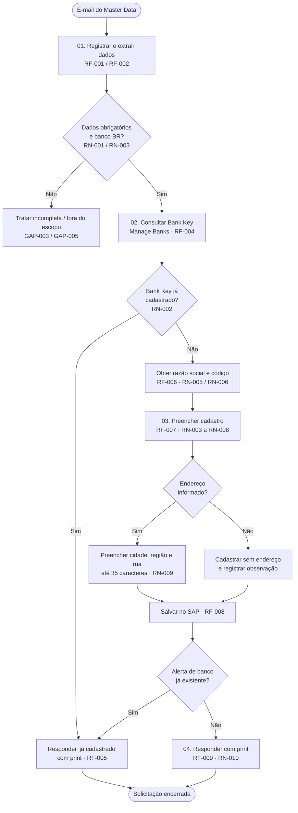

# Cadastro de Conta Bancária

| Campo | Valor |
|---|---|
| Contexto | FIN — Cadastro de Dados Mestres |
| Versão | v1.0 |
| Status | Em validação |
| Fonte | SOP - Cadastro de conta bancária (v1.0, 18/09/2026) |
| Atualizado | Hoje, às 10:35 |

> Ambiente de revisão e validação da especificação funcional. Revise pendências, consulte requisitos e navegue pelo processo.

---

# 1. Visão Geral

**Objetivo do processo:** Cadastrar no SAP (transação *Manage Banks*) o banco/agência solicitado pela área de Master Data, garantindo que pagamentos e extratos sejam escriturados corretamente.

| Item | Descrição |
|---|---|
| Gatilho | E-mail de solicitação enviado pela área de Master Data |
| Executor atual | Equipe de Cadastro (Operador SAP) |
| Solicitante / Informado | Master Data |
| Sistemas | SAP (Manage Banks), E-mail, Fonte pública de bancos |
| Frequência | Sob demanda; na maioria dos casos o banco já está cadastrado |
| Tempo atual | 5 a 10 min por cadastro |
| SLA | 2 dias (não confirmado — ver GAP-007) |

## Etapas

| ID | Etapa | Descrição |
|---|---|---|
| 01 | Receber e Conferir Solicitação | Receber o e-mail do Master Data e validar os dados obrigatórios |
| 02 | Consultar Banco no SAP | Pesquisar o Bank Key na transação Manage Banks |
| 03 | Cadastrar Banco no SAP | Preencher os campos conforme as regras e salvar |
| 04 | Responder Solicitante | Retornar ao Master Data com evidência (print) |

## Indicadores

| Requisitos | Regras | Pendências | Resolvidas |
|---|---|---|---|
| 9 | 10 | 8 | 0/8 |

---

# 2. Validação de Pendências

> Revise e responda às dúvidas identificadas pela análise do processo. Pendências de alto impacto aparecem primeiro.

---

## GAP-001 — Escopo do processo: banco ou conta da empresa?

| Campo | Valor |
|---|---|
| Criticidade | Alto |
| Status | Aberto |
| Responsável | Coordenação Financeira (FIN) |
| Etapa | 03. Cadastrar Banco no SAP |
| Itens afetados | RF-007, RN-004 |
| Atualizado | Hoje, 09:20 |

**Pergunta:** O processo deve cobrir apenas o cadastro do banco/agência (Bank Key) ou também o House Bank, a conta corrente (Account ID) e o vínculo com a conta do razão (G/L)?

**Contexto:** O objetivo do POP cita House Bank, Account ID e G/L Account, mas o procedimento descreve apenas a criação do Bank Key na transação Manage Banks.

**Por que é necessário:** Define o escopo da automação. Incluir House Bank e G/L adiciona etapas, campos e possivelmente aprovação contábil.

**Opções:**
- [ ] Apenas cadastro do banco/agência (Bank Key)
- [ ] Bank Key + House Bank + Account ID
- [ ] Bank Key + House Bank + Account ID + vínculo G/L
- [ ] Outro
- [ ] Resposta livre
- [ ] Não sei responder
- [ ] Não se aplica

---

## GAP-002 — Composição do Bank Key

| Campo | Valor |
|---|---|
| Criticidade | Alto |
| Status | Aberto |
| Responsável | Equipe de Cadastro (Operador SAP) |
| Etapa | 03. Cadastrar Banco no SAP |
| Itens afetados | RF-004, RF-007, RN-004 |
| Atualizado | Hoje, 09:20 |

**Pergunta:** O Bank Key é composto por código do banco + agência ou por código do banco + número da conta?

**Contexto:** O passo 5.2.3 indica código do banco + agência (ex.: 033 + agência). O passo 8.3.3 indica código do banco + número da conta usada nos pagamentos.

**Por que é necessário:** O Bank Key é a chave de busca de duplicidade e de criação. Uma regra errada gera cadastros duplicados ou buscas sem resultado.

**Opções:**
- [ ] Código do banco (3 dígitos) + agência
- [ ] Código do banco (3 dígitos) + número da conta
- [ ] Usar exatamente o valor enviado pelo Master Data, sem montar
- [ ] Outro
- [ ] Resposta livre
- [ ] Não sei responder
- [ ] Não se aplica

---

## GAP-003 — Tratamento de solicitação incompleta

| Campo | Valor |
|---|---|
| Criticidade | Alto |
| Status | Aberto |
| Responsável | Master Data |
| Etapa | 01. Receber e Conferir Solicitação |
| Itens afetados | RF-003, RN-001 |
| Atualizado | Hoje, 09:20 |

**Pergunta:** O que fazer quando o e-mail não traz banco, código do banco ou agência?

**Contexto:** O POP lista banco, código, agência e endereço como entradas obrigatórias, mas não define a ação quando faltam. Além disso, o endereço é tratado como opcional no cadastro.

**Por que é necessário:** Sem essa regra, o sistema não sabe se devolve, completa por busca pública ou segue parcialmente.

**Opções:**
- [ ] Devolver ao solicitante pedindo os dados faltantes e pausar o caso
- [ ] Completar automaticamente via fonte pública (código e nome) e devolver só se faltar agência
- [ ] Encaminhar para tratamento manual do operador
- [ ] Outro
- [ ] Resposta livre
- [ ] Não sei responder
- [ ] Não se aplica

---

## GAP-004 — Conteúdo do campo Bank Branch

| Campo | Valor |
|---|---|
| Criticidade | Médio |
| Status | Aguardando resposta |
| Responsável | Equipe de Cadastro (Operador SAP) |
| Etapa | 03. Cadastrar Banco no SAP |
| Itens afetados | RF-007 |
| Atualizado | Hoje, 09:20 |

**Pergunta:** O campo Bank Branch deve receber o número da agência ou o número da conta?

**Contexto:** Durante a demonstração, a explicação oscilou entre agência e conta. O passo 8.3.1 cita agência (ex.: 1893).

**Por que é necessário:** Define o mapeamento do dado de entrada para o campo SAP.

**Opções:**
- [ ] Número da agência
- [ ] Número da agência com dígito verificador
- [ ] Número da conta
- [ ] Outro
- [ ] Resposta livre
- [ ] Não sei responder
- [ ] Não se aplica

---

## GAP-005 — Bancos fora do Brasil

| Campo | Valor |
|---|---|
| Criticidade | Médio |
| Status | Aberto |
| Responsável | Coordenação Financeira (FIN) |
| Etapa | 01. Receber e Conferir Solicitação |
| Itens afetados | RF-003, RN-003 |
| Atualizado | Hoje, 09:20 |

**Pergunta:** Como tratar uma solicitação de banco de outro país?

**Contexto:** A executora nunca recebeu esse tipo de solicitação e supõe que outras localidades fazem o próprio cadastro. A regra não foi confirmada.

**Por que é necessário:** Define a regra de elegibilidade e o uso do campo Swift.

**Opções:**
- [ ] Rejeitar e orientar o solicitante a procurar a localidade responsável
- [ ] Encaminhar automaticamente para a localidade responsável
- [ ] Cadastrar preenchendo o Swift
- [ ] Outro
- [ ] Resposta livre
- [ ] Não sei responder
- [ ] Não se aplica

---

## GAP-006 — Quantidade de usuários da conta na resposta

| Campo | Valor |
|---|---|
| Criticidade | Médio |
| Status | Aberto |
| Responsável | Equipe de Cadastro (Operador SAP) |
| Etapa | 04. Responder Solicitante |
| Itens afetados | RF-005 |
| Atualizado | Hoje, 09:20 |

**Pergunta:** De onde vem a "quantidade de usuários que já utilizam essa conta" informada quando o banco já está cadastrado?

**Contexto:** O passo A1.2 pede essa informação na resposta, mas não indica a origem no SAP.

**Por que é necessário:** Sem a fonte do dado, o sistema não consegue montar a resposta completa.

**Opções:**
- [ ] Consulta de parceiros/fornecedores vinculados ao Bank Key no SAP
- [ ] Informação dispensável — remover da resposta
- [ ] Outro
- [ ] Resposta livre
- [ ] Não sei responder
- [ ] Não se aplica

---

## GAP-007 — SLA oficial de atendimento

| Campo | Valor |
|---|---|
| Criticidade | Baixo |
| Status | Aberto |
| Responsável | Coordenação Financeira (FIN) |
| Etapa | 01. Receber e Conferir Solicitação |
| Itens afetados | RF-001 |
| Atualizado | Hoje, 09:20 |

**Pergunta:** Qual é o SLA oficial para atender à solicitação?

**Contexto:** A executora mencionou 2 dias, sem certeza. Na prática, a execução leva menos de 10 minutos.

**Por que é necessário:** Define alertas de vencimento e o indicador de desempenho do processo.

**Opções:**
- [ ] 2 dias úteis
- [ ] 1 dia útil
- [ ] Mesmo dia (até 4 horas úteis)
- [ ] Outro
- [ ] Resposta livre
- [ ] Não sei responder
- [ ] Não se aplica

---

## GAP-008 — Modelo padrão das respostas por e-mail

| Campo | Valor |
|---|---|
| Criticidade | Baixo |
| Status | Aberto |
| Responsável | Master Data |
| Etapa | 04. Responder Solicitante |
| Itens afetados | RF-005, RF-009, RN-010 |
| Atualizado | Hoje, 09:20 |

**Pergunta:** Existe um texto padrão para as respostas "banco já cadastrado", "banco criado" e "banco criado sem endereço"?

**Contexto:** O POP não define o conteúdo das respostas nem onde fica registrada a observação de ausência de endereço.

**Por que é necessário:** Padroniza a comunicação gerada automaticamente.

**Opções:**
- [ ] Usar um modelo sugerido pelo sistema
- [ ] Usar um modelo enviado pela área
- [ ] Outro
- [ ] Resposta livre
- [ ] Não sei responder
- [ ] Não se aplica

---

# 3. Especificação Funcional

> Consulte requisitos, regras e o mapa do processo. v1.0 — Em validação

## 3.1 Requisitos Funcionais

---

### RF-001 — Receber e registrar solicitação de cadastro

| Campo | Valor |
|---|---|
| Status | Pendente de GAP |
| Etapa | 01. Receber e Conferir Solicitação |
| GAPs | GAP-007 |

**Descrição:** O sistema deve monitorar a caixa de entrada de solicitações, identificar e-mails de cadastro de banco enviados pelo Master Data e registrar cada solicitação com data e hora de recebimento.

**Objetivo:** Garantir rastreabilidade e controle de prazo de todas as solicitações.

**Ator / Perfil:** Master Data (solicitante)

**Entradas:**
- E-mail de solicitação
- Anexos (print de cheque ou extrato), quando houver

**Saída esperada:** Solicitação registrada com ID, solicitante, data e hora e status "Recebida".

**Exceções:**
- E-mail fora do padrão ou sem relação com cadastro de banco

**Critérios de aceite:**
- Dado um e-mail de solicitação válido, o sistema registra a solicitação em até 5 minutos após o recebimento.
- Dado um e-mail não relacionado ao processo, o sistema não abre solicitação.

**Relacionamentos:** RN-001 · GAP-007

---

### RF-002 — Extrair dados da solicitação

| Campo | Valor |
|---|---|
| Status | Confirmado |
| Etapa | 01. Receber e Conferir Solicitação |

**Descrição:** O sistema deve extrair do corpo e dos anexos do e-mail: nome do banco, código do banco (Bank Number), agência, Bank Key e endereço do banco.

**Objetivo:** Estruturar os dados necessários para a consulta e o cadastro no SAP.

**Ator / Perfil:** Sistema

**Entradas:**
- Corpo do e-mail
- Anexos de apoio (cheque ou extrato)

**Saída esperada:** Registro estruturado com os campos extraídos e o nível de confiança de cada um.

**Exceções:**
- Anexo ilegível
- Divergência entre o corpo do e-mail e o anexo

**Critérios de aceite:**
- Dado um e-mail com todos os dados, o sistema extrai 100% dos campos obrigatórios.
- Dada uma divergência entre o e-mail e o anexo, o sistema sinaliza a divergência para revisão.

**Relacionamentos:** RN-001 · RN-005

---

### RF-003 — Validar completude e elegibilidade da solicitação

| Campo | Valor |
|---|---|
| Status | Pendente de GAP |
| Etapa | 01. Receber e Conferir Solicitação |
| GAPs | GAP-003, GAP-005 |

**Descrição:** O sistema deve verificar se a solicitação contém os dados obrigatórios e se o banco é brasileiro antes de seguir para a consulta no SAP.

**Objetivo:** Evitar cadastros incompletos ou fora do escopo.

**Ator / Perfil:** Sistema

**Entradas:** Dados extraídos (RF-002)

**Saída esperada:** Solicitação classificada como "Apta", "Incompleta" ou "Fora do escopo".

**Exceções:**
- Dados obrigatórios ausentes
- Banco estrangeiro

**Critérios de aceite:**
- Dada uma solicitação sem agência, o sistema classifica como "Incompleta" e não segue para cadastro.
- Dada uma solicitação sem endereço, o sistema classifica como "Apta" (endereço não bloqueia).

**Relacionamentos:** RN-001 · RN-003 · GAP-003 · GAP-005

---

### RF-004 — Consultar Bank Key no SAP

| Campo | Valor |
|---|---|
| Status | Pendente de GAP |
| Etapa | 02. Consultar Banco no SAP |
| GAPs | GAP-002 |

**Descrição:** O sistema deve pesquisar o Bank Key informado na transação Manage Banks e identificar se o banco já está cadastrado.

**Objetivo:** Evitar cadastros duplicados.

**Ator / Perfil:** Sistema (integração SAP)

**Entradas:** Bank Key da solicitação

**Saída esperada:** Resultado "Já cadastrado" (com os dados do registro) ou "Não localizado".

**Exceções:**
- SAP indisponível

**Critérios de aceite:**
- Dado um Bank Key existente, o sistema retorna "Já cadastrado" e os dados do registro.
- Dado um Bank Key inexistente, o sistema retorna "Não localizado" e segue para o RF-006.

**Relacionamentos:** RN-002 · RN-004 · GAP-002

---

### RF-005 — Responder solicitação de banco já cadastrado

| Campo | Valor |
|---|---|
| Status | Pendente de GAP |
| Etapa | 04. Responder Solicitante |
| GAPs | GAP-006, GAP-008 |

**Descrição:** Quando o Bank Key já existir, o sistema deve responder ao solicitante informando o cadastro existente, anexando a evidência da tela do SAP e a quantidade de usuários que utilizam a conta.

**Objetivo:** Encerrar rapidamente as solicitações já atendidas, que são a maioria dos casos.

**Ator / Perfil:** Sistema → Master Data

**Entradas:**
- Resultado da consulta (RF-004)
- Print da tela do SAP

**Saída esperada:** E-mail de resposta enviado e solicitação encerrada como "Já cadastrado".

**Exceções:**
- Falha ao gerar a evidência

**Critérios de aceite:**
- Dado um banco já cadastrado, o sistema envia a resposta com o print anexado e encerra a solicitação.

**Relacionamentos:** RN-010 · GAP-006 · GAP-008

---

### RF-006 — Obter razão social e código do banco

| Campo | Valor |
|---|---|
| Status | Confirmado |
| Etapa | 03. Cadastrar Banco no SAP |

**Descrição:** O sistema deve obter a razão social e o código do banco a partir do documento enviado pelo solicitante ou, se não houver, de uma fonte pública de referência.

**Objetivo:** Garantir que o cadastro use o nome oficial do banco, e não o nome comercial.

**Ator / Perfil:** Sistema

**Entradas:**
- Nome e código informados
- Anexo de apoio
- Fonte pública de bancos

**Saída esperada:** Razão social e código do banco com 3 dígitos.

**Exceções:**
- Banco não encontrado na fonte pública (ex.: cooperativa de crédito)

**Critérios de aceite:**
- Dado "Santander", o sistema retorna "Banco Santander SA" e o código 033.
- Dado um anexo com o nome do banco, o sistema prioriza o nome do documento.

**Relacionamentos:** RN-005 · RN-006

---

### RF-007 — Preencher cadastro do banco no SAP

| Campo | Valor |
|---|---|
| Status | Pendente de GAP |
| Etapa | 03. Cadastrar Banco no SAP |
| GAPs | GAP-001, GAP-002, GAP-004 |

**Descrição:** O sistema deve acionar "Create" na transação Manage Banks e preencher os campos conforme as regras de negócio: Bank Country, Bank Key, Bank Name, Bank Branch, Bank Category, Bank Number e endereço.

**Objetivo:** Criar o cadastro padronizado do banco no SAP.

**Ator / Perfil:** Sistema (integração SAP)

**Entradas:**
- Dados validados (RF-003)
- Razão social e código (RF-006)

**Saída esperada:** Formulário de cadastro preenchido e pronto para gravação.

**Exceções:**
- Endereço maior que 35 caracteres
- Endereço não informado

**Critérios de aceite:**
- Dada uma solicitação apta, todos os campos obrigatórios são preenchidos conforme as RN-003 a RN-009.
- Os campos Swift, Bank Group e Intraday permanecem em branco.

**Relacionamentos:** RN-003 · RN-004 · RN-005 · RN-006 · RN-007 · RN-008 · RN-009 · GAP-001 · GAP-002 · GAP-004

---

### RF-008 — Gravar cadastro e tratar duplicidade

| Campo | Valor |
|---|---|
| Status | Confirmado |
| Etapa | 03. Cadastrar Banco no SAP |

**Descrição:** O sistema deve salvar o cadastro no SAP e tratar o alerta de banco já existente, caso seja exibido no momento da gravação.

**Objetivo:** Garantir que o cadastro foi efetivado ou corretamente identificado como duplicado.

**Ator / Perfil:** Sistema (integração SAP)

**Entradas:** Formulário preenchido (RF-007)

**Saída esperada:** Cadastro gravado com sucesso ou caso redirecionado para o RF-005.

**Exceções:**
- SAP exibe alerta de banco já existente
- Erro de gravação

**Critérios de aceite:**
- Dada uma gravação bem-sucedida, o sistema captura a tela final do cadastro.
- Dado um alerta de banco existente, o sistema não cria um novo registro e segue para o RF-005.

**Relacionamentos:** RN-002 · RF-005

---

### RF-009 — Responder solicitante com evidência do cadastro

| Campo | Valor |
|---|---|
| Status | Pendente de GAP |
| Etapa | 04. Responder Solicitante |
| GAPs | GAP-008 |

**Descrição:** O sistema deve responder ao e-mail do solicitante com o print da tela final e os dados do banco cadastrado, incluindo a observação "banco cadastrado sem informações de endereço" quando aplicável.

**Objetivo:** Fechar o ciclo com o Master Data e deixar evidência do cadastro.

**Ator / Perfil:** Sistema → Master Data

**Entradas:**
- Print da tela final (RF-008)
- Dados do cadastro

**Saída esperada:** E-mail de confirmação enviado e solicitação encerrada como "Cadastrado".

**Exceções:**
- Falha no envio do e-mail

**Critérios de aceite:**
- Dado um cadastro sem endereço, a resposta contém a observação de ausência de endereço.
- Toda resposta contém o print anexado.

**Relacionamentos:** RN-009 · RN-010 · GAP-008

---

## 3.2 Regras de Negócio

---

### RN-001 — Dados obrigatórios da solicitação

| Campo | Valor |
|---|---|
| Status | Pendente de GAP |
| Etapa | 01. Receber e Conferir Solicitação |
| GAPs | GAP-003 |

**Enunciado:** Toda solicitação deve conter banco, código do banco e agência para seguir para o cadastro.

**Condição:** Quando o sistema receber uma solicitação de cadastro.

**Comportamento esperado:** Solicitações completas seguem para consulta. Solicitações incompletas são tratadas conforme a definição do GAP-003.

**Exceções:**
- Endereço do banco: esperado, mas não bloqueia o cadastro (RN-009)
- Print de cheque ou extrato: opcional, usado apenas como apoio

**Critérios de aceite:**
- Dada uma solicitação sem código do banco, o sistema não segue para cadastro.

**Relacionamentos:** RF-002 · RF-003 · GAP-003

---

### RN-002 — Consulta prévia obrigatória

| Campo | Valor |
|---|---|
| Status | Confirmado |
| Etapa | 02. Consultar Banco no SAP |

**Enunciado:** Nenhum banco pode ser criado sem antes consultar o Bank Key na transação Manage Banks.

**Condição:** Antes de qualquer criação de cadastro.

**Comportamento esperado:** Se o Bank Key existir, o caso segue para a resposta "já cadastrado". Se não existir, segue para a criação.

**Exceções:**
- Alerta de duplicidade na gravação, tratado no RF-008

**Critérios de aceite:**
- Nenhuma criação ocorre sem registro de consulta prévia.

**Relacionamentos:** RF-004 · RF-008

---

### RN-003 — País do banco

| Campo | Valor |
|---|---|
| Status | Pendente de GAP |
| Etapa | 03. Cadastrar Banco no SAP |
| GAPs | GAP-005 |

**Enunciado:** O campo Bank Country deve ser sempre preenchido com BR (Brasil).

**Condição:** Em todo cadastro de banco.

**Comportamento esperado:** O sistema preenche BR automaticamente. Bancos estrangeiros são tratados conforme o GAP-005.

**Exceções:**
- Solicitação de banco estrangeiro

**Critérios de aceite:**
- Todo cadastro criado possui Bank Country = BR.

**Relacionamentos:** RF-003 · RF-007 · GAP-005

---

### RN-004 — Composição do Bank Key

| Campo | Valor |
|---|---|
| Status | Pendente de GAP |
| Etapa | 03. Cadastrar Banco no SAP |
| GAPs | GAP-001, GAP-002 |

**Enunciado:** O Bank Key deve começar com o código do banco (3 dígitos), seguido da agência ou da conta, conforme a definição do GAP-002.

**Condição:** Na consulta e na criação do cadastro.

**Comportamento esperado:** O sistema valida se o Bank Key informado segue a composição padrão antes de consultar ou criar.

**Exceções:**
- Bank Key enviado fora do padrão

**Critérios de aceite:**
- Dado o Santander, agência 1893, o Bank Key começa com 033.

**Relacionamentos:** RF-004 · RF-007 · GAP-001 · GAP-002

---

### RN-005 — Nome do banco pela razão social

| Campo | Valor |
|---|---|
| Status | Confirmado |
| Etapa | 03. Cadastrar Banco no SAP |

**Enunciado:** O Bank Name deve conter a razão social do banco, e não o nome comercial.

**Condição:** No preenchimento do campo Bank Name.

**Comportamento esperado:** Se houver documento de apoio, o sistema usa o nome exatamente como consta nele. Caso contrário, usa a razão social da fonte pública.

**Exceções:**
- Cooperativas de crédito: usar o nome do documento enviado

**Critérios de aceite:**
- "Santander" nunca é gravado sozinho; o cadastro recebe "Banco Santander SA".

**Relacionamentos:** RF-002 · RF-006 · RF-007

---

### RN-006 — Código do banco com 3 dígitos

| Campo | Valor |
|---|---|
| Status | Confirmado |
| Etapa | 03. Cadastrar Banco no SAP |

**Enunciado:** O Bank Number deve ter sempre 3 dígitos, completados com zeros à esquerda.

**Condição:** No preenchimento do Bank Number e na composição do Bank Key.

**Comportamento esperado:** O sistema normaliza o código automaticamente (33 → 033; 1 → 001).

**Exceções:** —

**Critérios de aceite:**
- Dado o código 33, o sistema grava 033.
- Dado o código 133 (Cresol), o sistema grava 133.

**Relacionamentos:** RF-006 · RF-007

---

### RN-007 — Categoria do banco

| Campo | Valor |
|---|---|
| Status | Confirmado |
| Etapa | 03. Cadastrar Banco no SAP |

**Enunciado:** O campo Bank Category deve ser sempre "Standard Bank", sem exceção.

**Condição:** Em todo cadastro de banco.

**Comportamento esperado:** O sistema preenche o valor fixo, sem edição.

**Exceções:** —

**Critérios de aceite:**
- Todo cadastro criado possui Bank Category = Standard Bank.

**Relacionamentos:** RF-007

---

### RN-008 — Campos que não devem ser preenchidos

| Campo | Valor |
|---|---|
| Status | Confirmado |
| Etapa | 03. Cadastrar Banco no SAP |

**Enunciado:** Os campos Swift, Bank Group e Intraday devem permanecer em branco.

**Condição:** Em todo cadastro de banco nacional.

**Comportamento esperado:** O sistema não preenche esses campos. O Swift é usado apenas para transferências a bancos no exterior.

**Exceções:**
- Banco estrangeiro (ver GAP-005)

**Critérios de aceite:**
- Nenhum cadastro nacional é gravado com Swift, Bank Group ou Intraday preenchidos.

**Relacionamentos:** RF-007

---

### RN-009 — Endereço do banco

| Campo | Valor |
|---|---|
| Status | Confirmado |
| Etapa | 03. Cadastrar Banco no SAP |

**Enunciado:** O endereço é opcional. Quando informado, o campo de rua deve conter rua/avenida, número e bairro em até 35 caracteres.

**Condição:** No preenchimento dos campos de endereço (cidade, região/estado e rua).

**Comportamento esperado:** Com endereço, o sistema preenche cidade, região e rua, abreviando se necessário. Sem endereço, cadastra sem esses campos e registra a observação para a resposta.

**Exceções:**
- Endereço que não cabe em 35 caracteres, mesmo abreviado: encaminhar para revisão

**Critérios de aceite:**
- Nenhum campo de rua é gravado com mais de 35 caracteres.
- Dado um cadastro sem endereço, a resposta contém a observação correspondente.

**Relacionamentos:** RF-007 · RF-009

---

### RN-010 — Evidência obrigatória na resposta

| Campo | Valor |
|---|---|
| Status | Pendente de GAP |
| Etapa | 04. Responder Solicitante |
| GAPs | GAP-008 |

**Enunciado:** Toda resposta ao solicitante deve conter o print da tela do SAP com os dados do banco.

**Condição:** No encerramento da solicitação (banco já cadastrado ou criado).

**Comportamento esperado:** O sistema anexa a evidência e usa o modelo de resposta definido no GAP-008.

**Exceções:**
- Falha na captura da tela: reter o envio e sinalizar o caso

**Critérios de aceite:**
- Nenhuma solicitação é encerrada sem evidência anexada.

**Relacionamentos:** RF-005 · RF-009 · GAP-008

---

## 3.3 Mapa do Processo

